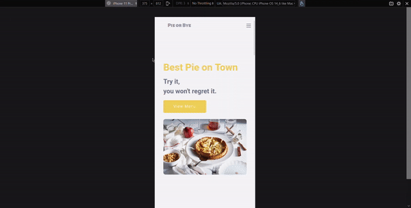

# PIE or BYE delivery :pie: | [LIVE DEMO](https://rusdiana97.github.io/restaurant-website.github.io/)

## 1. Project Description

*PIE or BYE delivery* is a restaurant website and it is a personal project. The project was made only by me in Visual Studio Code to check my knowledge about HTML, CSS and JavaScript. Also, with this project I improved my knowledge about CSS FlexBox, CSS Grid, animations and transitions made with CSS and JavaScript.

In short terms, in this project you will find:

- Responsive Web Desing
- Single-Page
- Animations and Transitions on scroll 
- Dark and Light Mode 

**For switch to Dark or Light Mode, be sure that you don't have Dark Theme active on your browser.**

## 2. How to Install / Run the Project

You have two choices:
1. download the entire project on your computer from Code -> Download Zip and open the index.html file on your browser for running the project
2. click on [LIVE DEMO](https://rusdiana97.github.io/restaurant-website.github.io/) for running the project on your browser (you won't download the project)

**I recommend you to see the [LIVE DEMO](https://rusdiana97.github.io/restaurant-website.github.io/) of the project.**

## 3. How to Use the Project

See more on [LIVE DEMO](https://rusdiana97.github.io/restaurant-website.github.io/)!

## 4. Credits

 - [Images](https://unsplash.com)
 - [Icons](https://fontawesome.com)
 - [Fonts](https://fonts.google.com)
